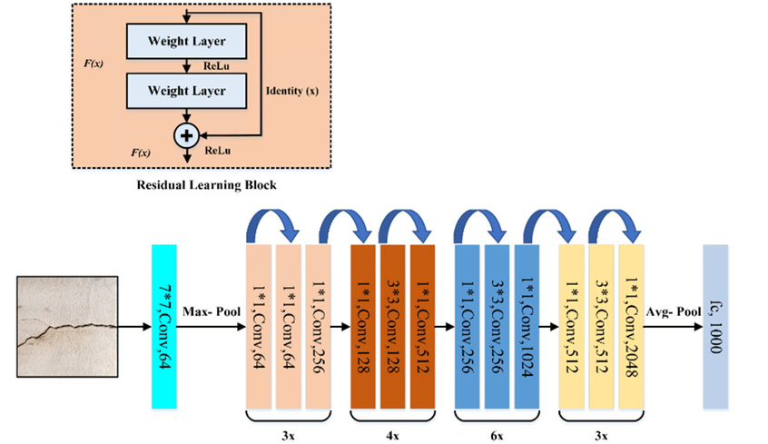
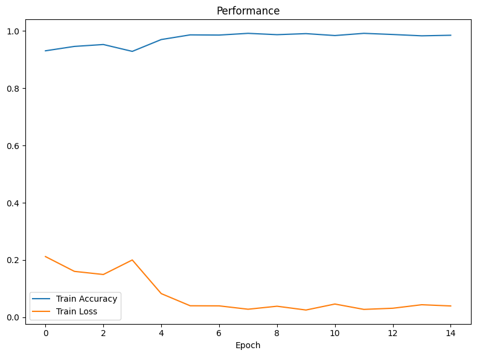
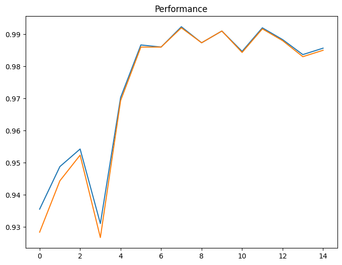

# ResNet-50 from Scratch on CIFAR-10 (Classes 0, 1, 2)

This project is a **from-scratch implementation of the ResNet-50 architecture** using TensorFlow/Keras, trained on a custom subset of the CIFAR-10 dataset (classes 0: airplane, 1: automobile, 2: bird).

The goal was to deeply understand residual networks by:
- Manually building **convolutional** and **identity blocks**
- Assembling the full **ResNet-50** architecture without using any prebuilt models
- Training it on a 3-class CIFAR-10 subset
- Visualizing training performance with metrics like accuracy, loss, precision, and recall

---

## Table of Contents
- Architecture Visuals
- Model Architecture
- Dataset
- Training Details
- Results
- Project Structure

---

## 📷 Architecture Visuals

<p float="left">
  
  
</p>

---

## Model Architecture

The ResNet-50 is composed of:
- 1 Convolutional + MaxPooling stem
- 4 stages of residual blocks (with increasing filter sizes)
- Each stage includes:
  - 1 **convolutional block** (with dimension match)
  - N **identity blocks** (residual learning)

The full block structure:
<pre> Input │ [CONV] │ [CONV BLOCK] │ [ID BLOCK *2] │ [CONV BLOCK] │ [ID BLOCK *3] │ [CONV BLOCK] │ [ID BLOCK *5] │ [CONV BLOCK] │ [ID BLOCK *2] │ [AVG POOL] │ [FLATTEN] │ [DENSE] │ Output (Classes) </pre>


Built **entirely from scratch**, without importing prebuilt ResNet layers.

---

## Dataset

- **Dataset:** CIFAR-10
- **Selected Classes:** 0 (airplane), 1 (automobile), 2 (bird)
- **Samples per class (train):** 1000
- **Input shape:** (32x32x3)
- **Normalization:** All pixels scaled to [0, 1]

---

## Training Details

| Setting          | Value              |
|------------------|--------------------|
| Optimizer        | Adam               |
| Learning Rate    | 0.0005             |
| Loss Function    | Categorical Crossentropy |
| Metrics Tracked  | Accuracy, Precision, Recall |
| Epochs           | 15                 |
| Batch Size       | Default            |

---

## 📊 Results

<p float="left">
  
  
</p>

- Increase in **accuracy**
- Drop in **loss**
- Good performance on both **precision** and **recall**

---

## 📁 Project Structure

```bash
resnet50-from-scratch-cifar10/
│
├── notebook.ipynb             # Complete implementation & training workflow
│
├── images/                    # Visuals and plots
│   ├── resnet.png             # Architecture diagram
│   ├── resnet_.jpg            # Block diagram of residual blocks
│   ├── acc_loss.png           # Training Accuracy & Loss graph
│   └── prec_recall.png        # Training Precision & Recall graph
```

---

## 👨‍💻 Author

**Nabeel Shan**  
Software Engineering Student - NUST Islamabad  
Aspiring AI Researcher | AI/ML Enthusiast  
[LinkedIn](https://www.linkedin.com/in/nabeelshan) • [GitHub](https://github.com/nabeelshan78)
- Looking to collaborate on AI/ML projects or research opportunities
- Currently mastering Deep Learning architectures through hands-on work

---

## ⭐ Star the Repo

If you found this helpful, please consider **starring** 🌟 the repository - it helps others discover this resource and motivates continued open-source contributions.

---

## How to Run

1. Clone the repo:
   ```bash
   git clone https://github.com/yourusername/resnet50-from-scratch-cifar10.git
   cd resnet50-from-scratch-cifar10
